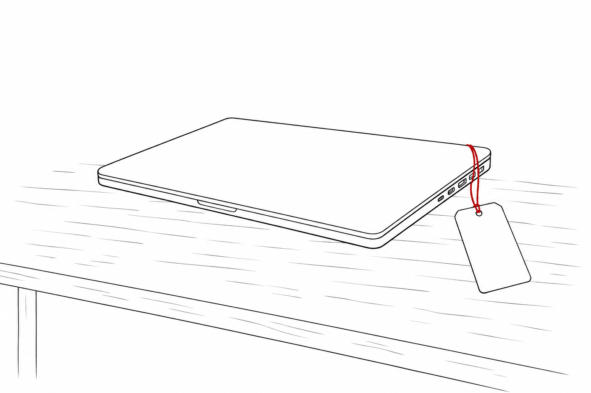

I live on a low income, under the federal poverty line. Every recurring cost is one I have to justify to myself, and AI is on that list. It earned its place because right now it is cheap. It is not free, but it is cheap enough that someone on my budget can run a capable model and get the work done, and that low price is the only reason it fits at all.

I do not expect that price to hold much past the summer. When the money is tight, even a modest increase can decide whether I keep the tool or let it go. I already spend a sizable share of what I have on enough tokens to work, and if that number climbs much, I will have to stop. I doubt I am alone in that. A lot of us are about to have this same reckoning over the next few months, most of us without any warning. People with room in their budget can absorb it, though paying more for the same access right as every other cost is climbing is a hard call even for them.

So I went looking at what is happening to the cost of AI, what economists here and abroad are saying, and whether any of it carries good news. Some of it does, but the place to start is why the price is so low to begin with.

### The companies make money on the API and lose it on the subscriptions

A price this low looks like a loss leader, as if the companies bleed money on every query. On the metered API, billed by the token, the opposite holds. By SemiAnalysis’s estimate, Anthropic’s margin on serving its models climbed to about 70% in a year, and selling tokens that way turns a profit for it and for OpenAI both.

The losses come from the other side of the business, the flat-rate plans. A fixed $200 a month buys a top tier like ChatGPT Pro or Anthropic’s Claude Max, and a heavy user on one of those plans can burn through far more compute than $200 would ever cover at metered prices. Sam Altman has said OpenAI loses money even on its $200 plan. Add the free tier, where most people pay nothing, and the cost of training the next model on top, and the hole gets enormous. By its own projections, OpenAI is on track to lose around $14 billion this year, and almost none of that comes from the metered tokens it sells. It comes from the flat plans and the free tier.

So that cheap deal is a sale. The companies set it low on purpose, to take the market while the race is on and to keep the free door open. A sale like that ends when the seller decides the land-grab is over and the numbers finally have to work, and that moment is arriving in a year when every other cost is climbing too.

### The bill behind it is the biggest in tech history, and it’s on credit

Look at what the buildout costs. Their 2026 earnings guidance has the five largest cloud companies spending around $725 billion on capacity, roughly two-thirds more than the year before, with about $450 billion of it going to AI hardware. They are increasingly borrowing to do it: more than $100 billion in debt was raised in 2025, and analysts expect far more to come. OpenAI alone projects spending $121 billion on compute in a single year by 2028.

Spending on that scale has to be earned back, and with borrowing costs still high, the math only works if the price of the product goes up. At the same time, the way we use AI is getting heavier. A quick chat is cheap, but a Microsoft Research analysis found that an agent reading a codebase, writing across it, running tests, and trying again can burn on the order of a thousand times the tokens of that chat, sometimes more than a week of ordinary use in a single run. So even as the price of a token keeps falling, the number of tokens a single task takes has climbed fast enough to swamp the savings.

### The free era is already being priced

In April 2026 OpenAI added a $100 tier between its cheap and flagship plans. The free tier now caps out fast, around ten messages before it drops to a lighter model, and since February it has run ads under the answers, on track for billions in ad revenue. Microsoft folded its assistant into Office and Google folded its into Workspace, raising the base price for everyone, in Google’s case by nearly a third for many accounts. We are already paying more, even where the headline API price looks lower. It arrives through the ads now running under the free answers and through the everyday subscription quietly creeping up.

### The squeeze started with energy, and it crossed every border

A war in the Middle East and the near-closure of the Strait of Hormuz knocked out a large share of the world’s oil this spring, and energy ran straight into everything else. US inflation climbed back to 3.8% in April, the highest in nearly three years, most of it energy. It reaches the grocery aisle too: with diesel near record highs, the USDA’s forecasters now expect food-at-home prices to rise around 3% this year, because diesel runs the tractors and the trucks.

The people whose job is to watch this agree on the shape, and not just in America. The IMF titled its spring outlook “Global Economy in the Shadow of War.” The OECD lifted its forecast for inflation across the big economies to 4% for 2026. Europe’s central bank raised its own number too, and named energy as the reason. Three institutions on two continents reached the same conclusion: it started with energy, and it is everywhere now.

### The worst of it is forecast to be temporary

Almost everyone forecasting this expects the worst of it to be temporary. The IMF, the OECD, and the European Central Bank all assume the energy spike fades through 2026 and inflation eases back toward normal in 2027. Nobody can promise the timing, and they all say so plainly, but the baseline is a bad year, not a permanent one.

For AI specifically, access will not vanish. It will split into tiers, and the cheaper tiers are already good. Open models from DeepSeek, Qwen, Google’s Gemma, and Microsoft’s Phi handle most of what I need for a fraction of the price, and some run on an ordinary laptop with no monthly bill at all. For someone in my spot, that is the part that matters most. When the frontier gets too expensive, I still have somewhere to go, and the cheaper place I land keeps getting better.

And closer to home, there is a cushion a lot of the world lacks. The US grows much of its own food, so when fuel makes imports pricier, we have more room to absorb it than places that depend on shipping their food in. It will not erase the squeeze, but it gives us more room than most have.

Where this goes is far from settled, and anyone who says otherwise is guessing. Everyday models keep getting cheaper, and a company with margins like Anthropic’s has room to cut prices further, so commodity AI may well stay cheap. For most of us, though, the pressure runs the other way in the near term, as inflation lifts every cost, the tools we lean on burn through more tokens, and the free door slowly closes behind us. Put those together and the likely direction is that we pay more.

So this is a year to plan for rather than panic over. My own plan is simple, if a little annoying. I am treating today’s cheap AI as a sale, and getting fluent in the budget and open options now, while it is still a choice. I price my tools as if they will cost more next year, and I keep a cheaper one within reach. Most of all I am watching the free tier, because that is where the price moves first.

---

*Jeff Kazzee writes about AI, careers, and learning to think clearly. [Subscribe on Substack](https://jeffkazzee.substack.com/subscribe) for the next essay. Find him on [X](https://x.com/jeffkazzee), [LinkedIn](https://www.linkedin.com/in/jeff-kazzee-759208373/), and [GitHub](https://github.com/jeff-kazzee).*
