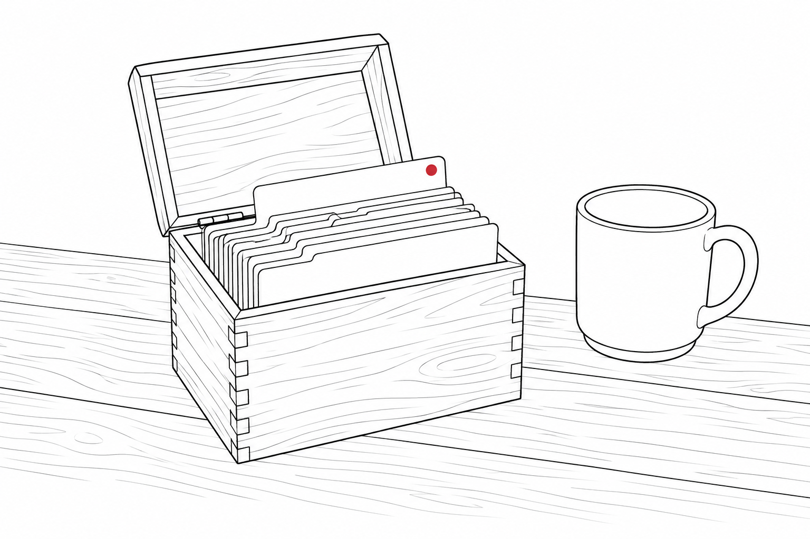
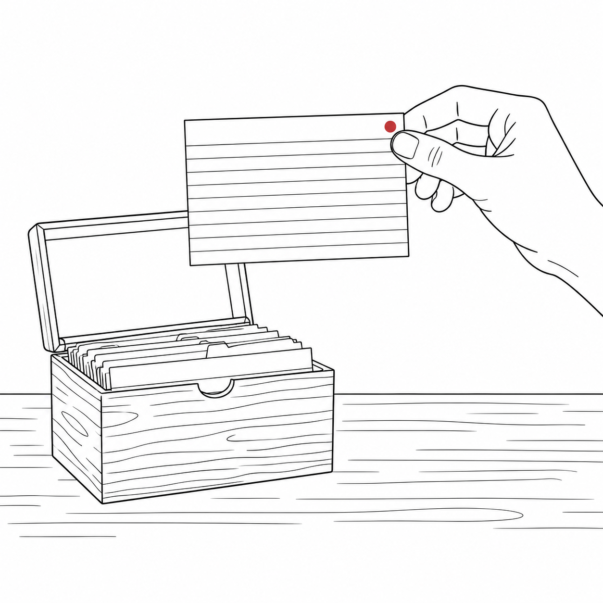

Zo Computer can do a lot. The hard part is figuring out what it can do for you on a given Tuesday night.

You open it. You see a workspace that will basically do anything you can describe to it. Your brain freezes on the question of what to describe first. You close the tab. A week later you tell a friend “I tried it but I didn’t really see what it could do for me.”

That is the gap the [Zo Cookbook](/projects/zo-cookbook/) fills, and I just shipped a big refresh to it. The catalog now holds 1,162 recipes. Each one is a specific job Zo can do for you, with the words or setup already written. The cookbook itself is free. Running a recipe needs a Zo Computer account, and my referral link is at the bottom if you want one.

Start with one of these five from the new batch. Each recipe page has a copy button and an open-Zo button. Click both, paste, run. Pick the one that matches the problem already sitting in your inbox, your wallet, your kid’s backpack, or your own body.

### 1. The Senior Parent Bill Concierge

For when your mom just got hit by a fake Norton renewal and still wants to keep control of her checking account. You open this after the second phone call about a charge she doesn’t remember.

The job: watch the bills you already know about, flag what’s due, and call out charges outside her normal range. You feed it the regulars (cable, utilities, the supplements that keep getting reordered) plus the rough monthly range each one should sit in. It watches the inbox you point it at. Zo shows due dates before they become late fees. A charge outside the normal range gets flagged the day it lands, not in next month’s statement.

A typical Tuesday email reads: “Comcast $89 normal, power $124 normal. One new charge: $39.99 from a merchant we’ve never seen.”

This is a heads-up system, not bill pay. It does not move money. Her accounts and passwords stay with her. That separation is the whole point.

### 2. The Bill Negotiation Script

Use this when your internet, phone, insurance, or credit card bill has crept up and you need words before you call.

You feed it the carrier, the current rate, when you signed up, and what you want. It writes you a short phone script: the specific request, the language for when they push back, the role to ask for (retention, not a regular agent), and one or two friendly concessions you can offer. You read it off the screen during the call.

The payoff is often $10 to $40 a month off a bill that crept up while you weren’t watching. The setup takes about ten minutes. The call takes fifteen. If it saves you $20 a month, it beats most household chores.

### 3. The “Is This A Scam?” Email Checker

Use this when an email, text, or DM feels off and you cannot tell whether it is a real bank notice, a phishing attempt, or a pushy company.

You paste the suspect message in. The prompt looks at the sender, the language, the link, the urgency cues, and the request. It gives you a four-way verdict: real, real but pushy, probably phishing, definitely phishing. It also gives one sentence explaining the tell that gave it away.

A real example I ran last month: a text claiming a USPS package was held for $1.99 in postage. Verdict: probably phishing. Tell: USPS doesn’t text about postage, and the URL behind the link didn’t lead to usps.com.

I think about this for my parents, but I have needed it myself. If you have a family member who has almost gotten taken in by one of these in the last year, run it twice with them. After that they will recognize the pattern on their own.

### 4. The “Why Am I Tired?” Pattern Finder

You have been wiped out for days or weeks and cannot figure out why. You want to see the obvious patterns before deciding whether this belongs in a doctor’s office.

This is the recipe I keep coming back to. It asks the boring questions a careful friend would ask first: your sleep, your caffeine, your work hours, the last time you ate three real meals, the last time you took a day off, your sun exposure, your alcohol week. It tells you which signal stands out and which ones do not.

It is explicit about not being medical advice. If the read points at something that belongs with a doctor, it says so. If the read points at “you have been sleeping six hours and drinking coffee at 4pm for two weeks,” it says that too.

This is where personal AI earns its keep. It gives you a structured second look at something you may already half-know.

### 5. The Permission Slip Stash

A catcher for school papers, the kind that come home in a backpack and disappear into the kitchen by Friday.

You know the failure mode. The form comes home in the backpack on Tuesday. You move it to the counter. It moves to the table. By Friday it is lost under three other things and you are scribbling a signature in the carpool line.

This recipe builds a small app inside Zo. You give it a photo, and it gives back a clean PDF and a tracked due date. The morning the form has to go back, you get a text. The cookbook lists the underlying tools (React, Hono, OCR, Twilio for the SMS). You do not need to know those tools because the recipe wires them up for you.

### A note on the copy button

Browsers won’t let the site paste directly into Zo because cross-site paste is blocked for security, which is how it should be. So the cookbook copies the prompt cleanly and opens Zo in the next tab. You paste and run.

### What’s not on the site

There are no “10X your productivity” headers. There are no recipes that promise to replace your job. There are no AI-art generators pretending to be marketing departments. Every entry is a small job: call this company, sort this form, check this message, explain this pattern.

The Lunch Decision Wheel is silly on purpose. It is a spinning wheel of the six places you actually order from, set up to remove the option you picked last time. Nobody needs a manifesto for lunch. It might keep Tuesday from becoming the third burrito day in a row.

### Try one tonight

Pick the bill, the form, the suspicious message, or the tired week you already have. Open the recipe on the site. Run it on the real thing, not a sample.

The site is at [zo-cookbook.space](https://www.zo-cookbook.space). If you don’t have Zo Computer yet and want to try it, my referral link is [zo-computer.cello.so/X9jcdFXqh9Z](https://zo-computer.cello.so/X9jcdFXqh9Z).

If a recipe breaks, reply with the recipe name and what happened. That is how the next batch gets better.

The cookbook turns “what could I do with this thing” into “tonight, do this.” That is the whole point.

---

*Jeff Kazzee writes about AI, careers, and learning to think clearly. [Subscribe on Substack](https://jeffkazzee.substack.com/subscribe) for the next workshop. Find him on [X](https://x.com/jeffkazzee), [LinkedIn](https://www.linkedin.com/in/jeff-kazzee-759208373/), and [GitHub](https://github.com/jeff-kazzee).*
