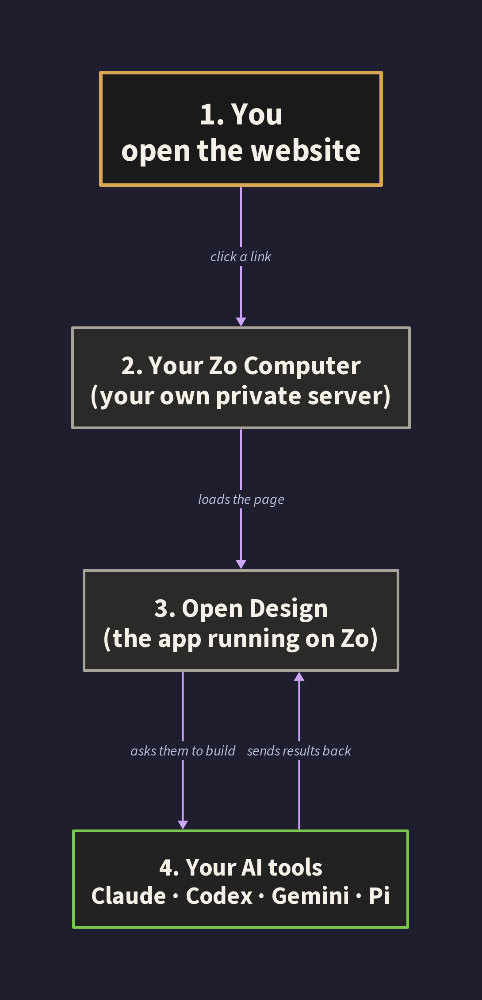
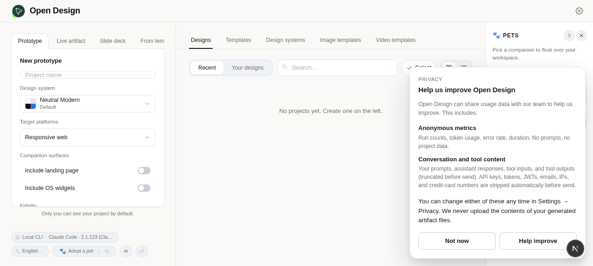
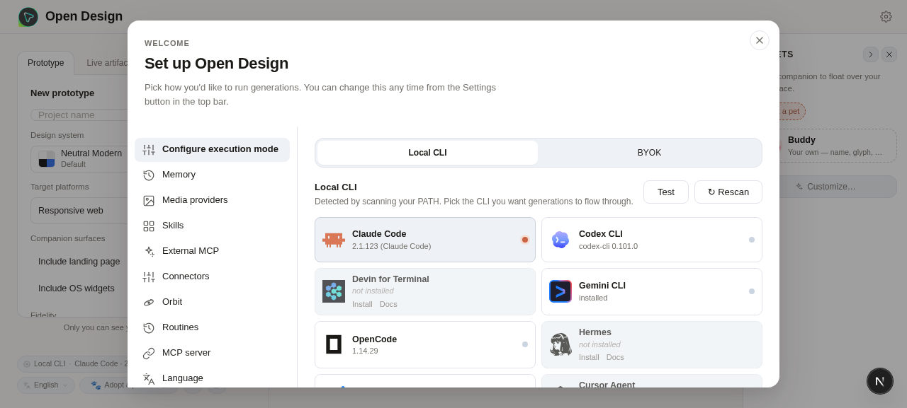
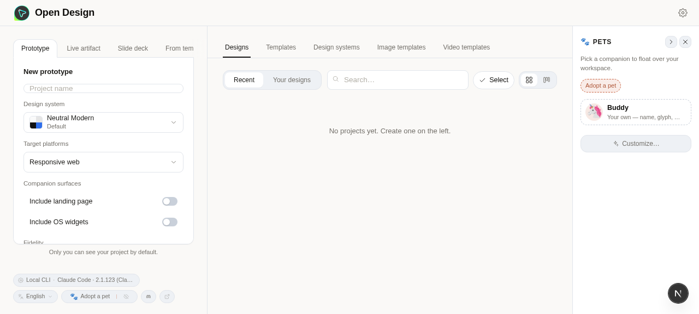

Last week I installed a design app on my own server. It runs at a private web address only I can reach. It restarts itself when it crashes. I never opened a terminal. I do not write code. I asked for it in a chat window and ten minutes later it was running.

If you have ever read a blog post about “self hosting” and bounced off because every guide assumes you already know what nginx is, this one is for you. I am going to walk you through what I did, what broke, and what I actually learned, in the order it happened.

### **What self hosting even means**

A self-hosted app is software you run on your own server instead of paying somebody else to run it for you. Notion is hosted by Notion. Dropbox is hosted by Dropbox. The self-hosted equivalents (AppFlowy, Nextcloud, and so on) run on a server you control. You pay for the server once. The software is usually free or close to it.

For most of the last twenty years, this was a hobby for people who liked operating systems. You had to rent a Linux server, learn how to administer it, write configuration files, manage security certificates, restart things by hand. The software was free. The time cost was high.

That has shifted. The server I use is called Zo Computer. It is a Linux server with a chat window stapled to the front. I do not configure anything by hand. I ask. The point of this post is to show what that actually looks like. My [Zo 101 guide](/projects/zo-computer-101/) covers the basics if you are starting there.

### **What I was trying to install**

The app is [Open Design](https://github.com/nexu-io/open-design), made by a small team called nexu-io. It is a design tool that uses AI coding assistants to generate prototypes, slides, and other artifacts. The relevant detail is that I already had several coding assistants installed on Zo (Claude Code, Codex, Pi), and Open Design knows how to use whichever ones it finds.



If Open Design is not your thing, this post is still useful. Substitute any of the apps in this list: Linkding (bookmarks), Memos (notes), Miniflux (RSS), Vaultwarden (passwords), Forgejo (a private GitHub), n8n (Zapier in self-hosted form), Penpot (Figma), NocoDB (Airtable). They all install the same way. Same five sentences in chat.

### **The single prompt that started it all**

I opened my Zo chat window and typed this:

> *Install Open Design from https://github.com/nexu-io/open-design on this Zo. Clone it into Projects, install all dependencies, run any build steps it needs, and register it as a private user service that auto restarts. Make sure my coding assistants are detected. When it is running, give me the private URL and tell me anything that needed special handling.*

That prompt is doing four jobs at once. The shape repeats for almost everything else I install, so it is worth breaking down.

“Install Open Design from [URL]” tells Zo what to install and where the source code lives.

“Clone it into Projects, install all dependencies, run any build steps” tells Zo to do the full setup, not just half of it. Many tutorials stop at “download the code” and leave you stranded with a folder full of files and no way to run them. I want a finished install.

“Register it as a private user service that auto restarts” is the line that turns a one-time experiment into a real thing. Without it, the app runs while I am watching and dies the moment I close my chat. With it, the app gets a permanent web address and Zo babysits it forever. This is the single most important sentence in the prompt.

“When it is running, give me the private URL and tell me anything that needed special handling” is the line that saves me hours later. I want Zo to surface anything weird in chat now, not silently bury it in a log file for me to find at 1am.

If you take nothing else away from this post, take that four-part shape. What to install, how completely to install it, what runtime to register it as, what to report when done.

### **What happened next, all on its own**

I went and made coffee. Ten minutes later, Zo reported back. It had downloaded the right version of Node.js (the engine that runs the app’s underlying code), pulled in all the supporting libraries, built the app, written a small startup script, and registered the whole thing as a service. The output included a permanent URL like

https://open-design-yourname.zo.computer

 and a note that everything was running.



This is the part of every self-hosting blog post where the author says “and now you have your own app running, congratulations!” That is rarely where it actually ends. Three things broke after Zo declared success, and each one taught me something I now apply to every install.

### **Mistake one: the AI refused to do anything**

I opened the URL. The page loaded. Claude Code appeared in the dropdown of available coding assistants. I typed a request. Nothing happened.



I asked Zo to check the error log. It came back with one line:

```
`--dangerously-skip-permissions cannot be used with root/sudo privileges for security reasons`
```

Translation: Open Design was trying to launch Claude with a permissive flag that lets it write files anywhere on the system. Anthropic, sensibly, refuses to honor that flag when the user is the all-powerful admin account on a Linux system (called “root”). Zo’s server runs as root by default, for reasons that have to do with how its sandboxing works. Open Design did not know that.

This is a class of mistake I will see again and again. An app makes an assumption that is fine on a developer’s laptop and wrong on a real server. Not anyone’s fault, exactly. Just a gap between two reasonable defaults.

The fix was one message: “Claude refuses to run because I am the admin user. Switch Open Design to a safer permission mode, and make the change stick across restarts.” Zo found the line in the code, swapped the risky shortcut for a safer one, saved that choice as a configuration value the app reads on every boot, and restarted everything.

The takeaway: when an app installs but does not work, the error log is the first thing to ask for. Most cloud servers run as the admin user. Apps written for a laptop often assume they are not.

### **Mistake two: the app kept dying two seconds after starting**

I refreshed the page. It loaded. Two seconds later it died and refused to come back. Refreshing gave me a connection error.

The error log said: `ELIFECYCLE Command failed.` That is not a helpful message. It just means “something exited badly,” with no detail about what.

I pasted it into chat anyway. Zo figured it out. The startup script that Zo had originally written was using Open Design’s *development* launcher by accident, not its *production* launcher.

That distinction is the one I most wish I had known about before. Almost every app you can self host has two ways to run. A development mode for the original author to use on their own laptop while they are still writing code. And a production mode designed to run unattended on a server. They look almost identical from the outside. The first one leaves little tracking files behind and assumes someone is watching it. The second one is built to survive restarts and not leak state.

Zo had picked the wrong one. When Zo’s auto-restart system tried to relaunch the app cleanly after every test, the stale tracking files from the previous run confused the new launch, and the app gave up.

The fix was one message: “Swap the development launcher for the production launcher and try again.” Zo rewrote the startup script and restarted. The page stayed up.

The rule of thumb I now apply to everything: if you see commands like `npm run dev` and `npm run start` side by side in an app’s instructions, the second one is the one you want on a server. The first one is for the person writing the app, not for you.

### **Mistake three: black screen of nothing**

This one is my favorite, because the symptom was completely uninformative. The service was up. Zo confirmed the server was responding to requests on the local machine. The public URL loaded a page. But the page was just black. No error message, no spinner, no login form. Black.

I took a screenshot and pasted it into chat. “The URL loads but the page is black. The service is running locally.”

Zo found a security check inside the app. The server side of Open Design was hardcoded to only trust requests coming from the local machine. My browser was hitting the public URL, so when the page tried to fetch any data, the server silently refused to talk to it. The page itself loaded fine. It just got nothing back from the server, rendered its empty shell, and showed me a black void.

The fix was a single configuration line:

```
`OD_ALLOWED_ORIGINS="https://open-design-yourname.zo.computer"`
```

That tells the server “also trust requests coming from this address.” Added it, restarted, refreshed. The page rendered. Thirty seconds, start to finish.

The browser safety rule behind this is called CORS, and most self-hosted apps default to trusting only the local machine. Worth recognizing on sight, because the black-screen-no-error symptom is otherwise impossible to diagnose. If a self-hosted app loads but seems to do nothing, ask Zo to check whether it is rejecting requests from the public URL.

### **How to talk to Zo when something breaks**

Three problems, all fixed by short messages in chat. There is a pattern to those messages that took me a few tries to learn.

#### **Describe what you see, not your theory**

“The URL returns a 502 error” gives Zo a useful clue. “I think it is probably a permissions thing” pulls Zo toward whatever sounds plausible whether or not it is the actual cause. A half formed theory is worse than no theory.

#### **Hand Zo the data, not a hypothesis**

“Pull the last fifty lines of the error log for `open-design`“ beats “why is it not working.” A specific file in the answer is almost always better than a guess. Screenshots count as data. So do exact error messages copied verbatim.

#### **When Zo goes in circles, stop**

Three failed fixes is my cutoff. At that point I write: “Stop. Tell me what you actually know about this problem and what you are guessing.” The right answer is sometimes “I do not know yet, here are the suspect areas.” That is far more useful than another wrong guess delivered confidently.

The bad prompts I started with looked like: “Something is broken can you fix it.” The good prompts look like: “When I open the URL the page is black. The error log shows X. Find the cause.” The difference in response quality is large.

### **What else this same pattern works for**

The install loop you just watched, one prompt and three small fixes, is the same loop for almost every self-hostable app worth running. I have used it for password vaults, RSS readers, automation tools, and code hosts. Here is the honest catalog.

#### **Works without fuss**

Any web app that runs on a single port. Linkding, Memos, Miniflux, Vaultwarden, Forgejo, n8n, Penpot, NocoDB. Background workers and bots that do not need a webpage. Databases that only need to talk to themselves (Postgres, Redis). Static personal sites (use Zo Space for those, no service needed).

#### **Works with care**

Apps that hardcode their public address on first run (Mastodon, Outline) need you to tell them the right address before they ever start, or they will remember the wrong one forever. Apps that need a setup wizard want a brief public preview before you flip them to private. Electron apps (the ones that look like apps but are really packaged websites) usually have a headless mode that does the important work without a visible window.

#### **Does not work**

VPN servers need deeper system access than Zo allows for safety. Heavy local AI inference needs a graphics card bigger than Zo currently has, so point Ollama at NVIDIA NIM instead. Anything that wants physical hardware like USB devices or webcams has nothing on Zo to bind to. Mac and Windows only software does not run on Linux.

The shortcut: if an app runs on a normal Linux cloud server, it runs on Zo. If it needs a screen, deep system access, or specific hardware, it does not.

### **One honest limit worth knowing**

If your AI coding assistant uses a subscription plan (like Claude Max), the app you self host will inherit your usage cap. When you hit it mid-generation, the app shows the error from the provider. The workaround is to keep an API key from a different provider on hand as a backup. I keep a Gemini API key in Zo’s Settings under Advanced > Secrets and point Open Design at it when Claude is tapped out. Tech blogs call this BYOK, for Bring Your Own Key. Worth setting up before you need it.

### **What I actually learned**

A few things changed in how I think about self hosting after this.

The install was the easy part. I expected it to be the whole job and it was about twenty percent of it. The remaining eighty percent was understanding what broke. None of those breaks needed code. They needed a clear description of the symptom and a willingness to read the error.

Almost every problem was an assumption an app’s author made about their own laptop that did not hold on a server. Admin user. Development mode. Trusted addresses. Each one was a reasonable default for the author and the wrong default for me. None of them were defects, and none of them were obvious from the README.

The real benefit of having a chat-driven server is that it removes the apprenticeship. I do not need three years of Linux experience to ask “the page is black, check whether the server is rejecting requests from the public URL.” I just need to know that question exists.

### **Try it yourself**



If you have an app you have meant to run yourself, open your Zo chat and try the prompt at the top of this post with the app’s GitHub URL substituted. Read the report when it finishes. If something breaks, paste the symptom into chat and follow the conversation.

I do not think self hosting is for everyone. It still takes attention. But the floor is dramatically lower than it used to be, and the apps you can run yourself include real alternatives to things you currently pay monthly for.

The first time it works, you get a small surprising feeling: this is mine, it lives on my server, no one else can see it, and I did not have to learn Linux to make it happen.

Worth the twenty minutes.

---

*Open Design is by [nexu-io](https://github.com/nexu-io/open-design), AGPL 3.0 licensed. If you want a Zo Computer of your own, you can [start one here](https://zo-computer.cello.so/X9jcdFXqh9Z).*

*If this was useful, the simplest thanks is to subscribe and forward it to one person who has bookmarked a self-hosting guide and never followed through. That is who I wrote it for.*
